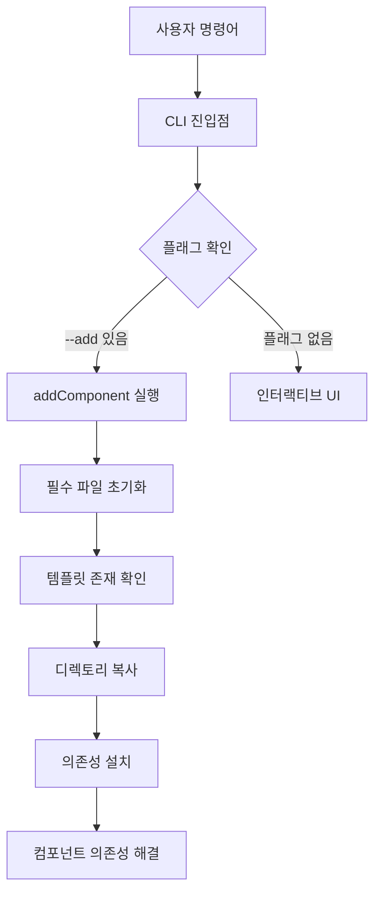

# 📁 tree-cli 파일 복사 시스템 문서

> tree-cli의 핵심 기능인 `path`와 `fs-extra`를 활용한 파일 복사 시스템에 대한 상세 설명

## 🎯 개요

tree-cli는 **shadcn/ui에서 영감을 받은** CLI 도구로, 재사용 가능한 컴포넌트를 다른 프로젝트에 쉽게 복사하는 것이 주요 기능입니다. 이 시스템은 Node.js의 `path` 모듈과 `fs-extra` 라이브러리를 사용하여 구현되었습니다.

## 🏗️ 시스템 아키텍처



## 📦 핵심 라이브러리

### 1. `path` 모듈

- **역할**: 파일 경로 조작 및 관리
- **주요 사용법**:
  - `path.join()`: 경로 결합
  - `path.dirname()`: 디렉토리 경로 추출
  - `process.cwd()`: 현재 작업 디렉토리

### 2. `fs-extra` 라이브러리

- **역할**: 파일 시스템 조작 (Node.js fs 모듈의 확장)
- **주요 기능**:
  - `fs.copy()`: 디렉토리/파일 복사
  - `fs.ensureDir()`: 디렉토리 생성 보장
  - `fs.existsSync()`: 파일/디렉토리 존재 확인
  - `fs.readJson()`/`fs.writeJson()`: JSON 파일 조작

## 🔧 핵심 구현 분석

### 1. 메인 복사 함수 (`addComponent`)

```typescript
export async function addComponent(name: string) {
	// 1. 경로 설정
	const templatePath = path.join(__dirname, '..', '..', 'templates', name);
	const targetPath = path.join(process.cwd(), 'src/components/custom-ui', name);

	// 2. 프로젝트 초기화
	initializeRequiredFiles();

	// 3. 템플릿 존재 확인
	if (!fs.existsSync(templatePath)) {
		console.error(`❌ ${name} 템플릿이 존재하지 않아요.`);
		return;
	}

	// 4. 디렉토리 생성 및 복사
	await fs.ensureDir(targetPath);
	await fs.copy(templatePath, targetPath);

	// 5. 의존성 처리
	await handleDependencies(templatePath);
}
```

#### 주요 특징:

- **경로 안전성**: `path.join()`으로 운영체제별 경로 처리
- **비동기 처리**: `async/await`로 파일 복사의 안전한 처리
- **에러 핸들링**: 템플릿 존재 여부 사전 확인

### 2. 필수 파일 초기화 (`initializeRequiredFiles`)

```typescript
export async function initializeRequiredFiles() {
	const templatesUtilsPath = path.join(
		__dirname,
		'..',
		'..',
		'templates/utils.ts',
	);
	const utilsPath = path.join(process.cwd(), 'src/lib/utils.ts');

	// utils.ts 파일 복사 또는 생성
	if (!exists(utilsPath)) {
		if (exists(templatesUtilsPath)) {
			await fs.copy(templatesUtilsPath, utilsPath);
		} else {
			await fs.ensureFile(utilsPath);
			await fs.writeFile(utilsPath, '// utils 함수들을 여기에 작성하세요\n');
		}
	}

	// UI 디렉토리 생성
	const uiDir = path.join(process.cwd(), 'src/components/custom-ui');
	if (!exists(uiDir)) {
		await fs.ensureDir(uiDir);
	}
}
```

#### 주요 특징:

- **조건부 생성**: 파일이 없을 때만 생성하여 기존 파일 보호
- **shadcn/ui 호환**: 표준적인 프로젝트 구조 유지
- **백업 로직**: 템플릿 파일이 없어도 기본 파일 생성

### 3. 의존성 관리 (`installDeps`)

```typescript
export async function installDeps(deps: string[]) {
	const projectPackageJsonPath = path.join(process.cwd(), 'package.json');
	let projectPackageJson = await fs.readJson(projectPackageJsonPath);

	let changed = false;

	deps.forEach(pkg => {
		const [pkgName, pkgVersion = 'latest'] =
			pkg.includes('@') && pkg.lastIndexOf('@') > 0
				? [
						pkg.substring(0, pkg.lastIndexOf('@')),
						pkg.substring(pkg.lastIndexOf('@') + 1),
				  ]
				: [pkg, 'latest'];

		if (
			!projectPackageJson.dependencies?.[pkgName] &&
			!projectPackageJson.devDependencies?.[pkgName]
		) {
			projectPackageJson.dependencies = projectPackageJson.dependencies || {};
			projectPackageJson.dependencies[pkgName] = pkgVersion;
			changed = true;
		}
	});

	if (changed) {
		await fs.writeJson(projectPackageJsonPath, projectPackageJson, {spaces: 2});
		await execa('pnpm', ['install'], {stdio: 'inherit', cwd: process.cwd()});
	}
}
```

#### 주요 특징:

- **중복 방지**: 이미 설치된 패키지는 건너뛰기
- **버전 관리**: `@버전` 형식 지원
- **자동 설치**: package.json 수정 후 자동으로 `pnpm install` 실행

## 📁 디렉토리 구조

### CLI 패키지 구조

```
tree-cli/
├── templates/              # 템플릿 저장소
│   ├── utils.ts            # 기본 유틸리티
│   ├── tiptap/            # Tiptap 에디터
│   │   ├── core/          # 핵심 컴포넌트
│   │   ├── menus/         # 메뉴 컴포넌트
│   │   ├── dependencies.json  # 의존성 정의
│   │   └── ...
│   ├── button/            # 버튼 컴포넌트
│   └── dialog/            # 다이얼로그 컴포넌트
└── source/
    ├── cli.tsx            # CLI 진입점
    └── utils/             # 유틸리티 함수들
```

### 사용자 프로젝트 구조 (복사 후)

```
my-project/
├── src/
│   ├── lib/
│   │   └── utils.ts       # 유틸리티 (자동 생성)
│   └── components/
│       ├── ui/            # shadcn/ui 컴포넌트
│       └── custom-ui/     # tree-cli 컴포넌트
│           └── tiptap/    # 복사된 tiptap 컴포넌트
└── package.json           # 의존성 자동 추가
```

## 🔄 복사 프로세스

### 1단계: 경로 계산

```typescript
// CLI 패키지 내부 템플릿 경로
const templatePath = path.join(__dirname, '..', '..', 'templates', name);
// 예: /node_modules/@knu9910/tree-cli/templates/tiptap

// 사용자 프로젝트 목적지 경로
const targetPath = path.join(process.cwd(), 'src/components/custom-ui', name);
// 예: /Users/user/my-project/src/components/custom-ui/tiptap
```

### 2단계: 안전성 검사

```typescript
// 템플릿 존재 여부 확인
if (!fs.existsSync(templatePath)) {
	console.error(`❌ ${name} 템플릿이 존재하지 않아요.`);
	return;
}
```

### 3단계: 디렉토리 준비

```typescript
// 목적지 디렉토리 생성 (중간 경로 포함)
await fs.ensureDir(targetPath);
```

### 4단계: 파일 복사

```typescript
// 전체 디렉토리 재귀적 복사
await fs.copy(templatePath, targetPath);
```

### 5단계: 의존성 처리

```typescript
// dependencies.json 파일 확인 및 처리
const depsPath = path.join(templatePath, 'dependencies.json');
if (fs.existsSync(depsPath)) {
	const depsJson = await fs.readJson(depsPath);

	// npm 패키지 설치
	if (depsJson.packages) {
		await installDeps(depsJson.packages);
	}

	// 컴포넌트 의존성 재귀 설치
	if (depsJson.components) {
		for (const depComp of depsJson.components) {
			await addComponent(depComp);
		}
	}
}
```

## 🎯 dependencies.json 시스템

각 컴포넌트는 `dependencies.json` 파일로 의존성을 정의합니다:

```json
{
	"packages": ["react@18.2.0", "@radix-ui/react-dialog", "lucide-react"],
	"components": ["button", "input"]
}
```

### 처리 로직:

1. **packages**: npm 패키지들을 `package.json`에 추가하고 설치
2. **components**: 다른 컴포넌트들을 재귀적으로 설치

## 💡 핵심 특징

### 1. 안전한 파일 조작

- `fs-extra`의 `ensureDir()`로 디렉토리 존재 보장
- `existsSync()`로 사전 검사
- 비동기 처리로 안정성 확보

### 2. 크로스 플랫폼 호환성

- `path.join()`으로 운영체제별 경로 구분자 처리
- `process.cwd()`로 현재 작업 디렉토리 동적 감지

### 3. 지능적 의존성 관리

- 중복 설치 방지
- 버전 관리 지원
- 재귀적 컴포넌트 의존성 해결

### 4. 에러 처리

- 템플릿 존재 여부 확인
- 의존성 설치 실패 시 에러 전파
- 사용자 친화적 에러 메시지

## 🚀 사용 예시

```bash
# 기본 사용법
npx @knu9910/tree-cli --add tiptap

# 실행 과정:
# 1. templates/tiptap 디렉토리를 src/components/custom-ui/tiptap로 복사
# 2. tiptap/dependencies.json 읽기
# 3. 필요한 npm 패키지들 설치
# 4. 의존 컴포넌트들 재귀적 설치
```

## 🔍 디버깅 정보

코드에서 경로 정보를 출력하여 디버깅을 지원합니다:

```typescript
console.log('templatePath:', templatePath);
console.log('targetPath:', targetPath);
```

이를 통해 사용자는 실제 복사가 어떤 경로에서 어떤 경로로 이루어지는지 확인할 수 있습니다.

## 🏁 결론

tree-cli의 파일 복사 시스템은 `path`와 `fs-extra`를 활용하여:

1. **안전하고 신뢰할 수 있는** 파일 복사
2. **크로스 플랫폼 호환성**
3. **지능적인 의존성 관리**
4. **사용자 친화적인 경험**

을 제공합니다. 이를 통해 개발자들은 복잡한 컴포넌트도 한 번의 명령어로 쉽게 프로젝트에 추가할 수 있습니다.
